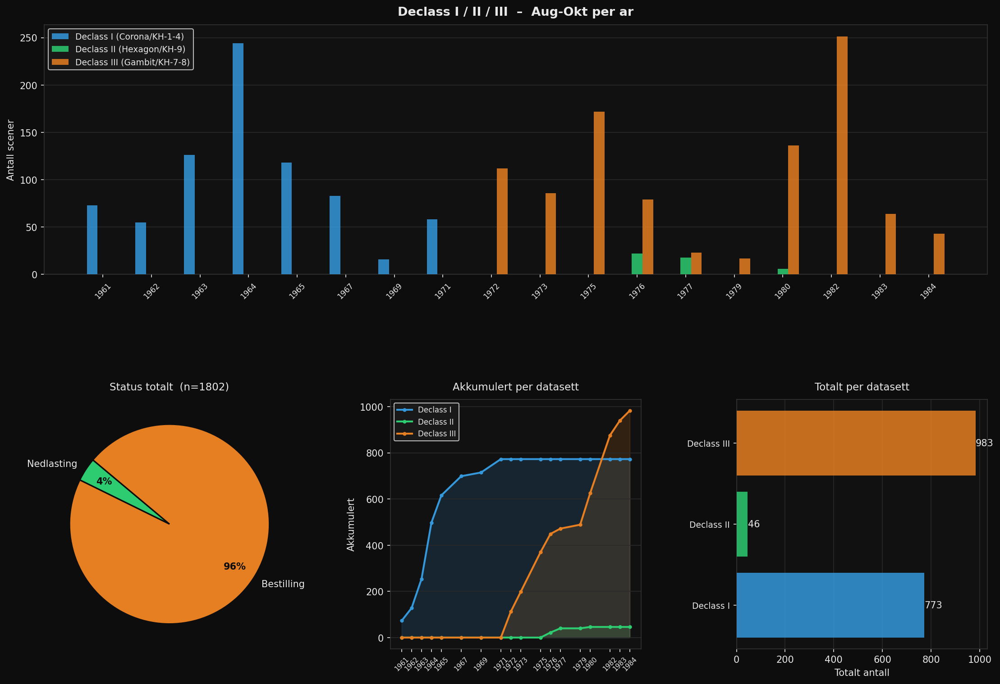

# Deklassifiserte spionsatellittbilder over Norge
### Declass I / II / III – August–Oktober

Oversikt over tilgjengelige bilder fra USAs deklassifiserte satellittprogram over Norge,
tatt i perioden august–oktober. Data er hentet fra [USGS EarthExplorer](https://earthexplorer.usgs.gov/)
via Machine-to-Machine (M2M) API.

**[Åpne interaktivt kart](https://TorgeirFerdinandKlingenberg.github.io/norway-declass-imagery)**

---

## Datasett

| Program | USGS-navn | Periode | Scener (aug–okt) |
|---|---|---|---|
| Corona (KH-4A/4B) | Declass I | 1961–1971 | 773 |
| KH-7 + KH-9 kartlegging | Declass II | 1976–1980 | 46 |
| KH-9 Hexagon panorama | Declass III | 1972–1984 | 983 |
| **Totalt** | | **1961–1984** | **1802** |

## Tilgjengelighet

| Status | Antall | Andel |
|---|---|---|
| Klar for nedlasting | 69 | 4 % |
| Krever bestilling / skanning | 1733 | 96 % |

De fleste bildene må bestilles for skanning fra originalt filmarkiv hos USGS EROS.
Bestilling gjøres via [EarthExplorer](https://earthexplorer.usgs.gov/) for $30 per scene.

## Om kartet

Det interaktive kartet viser footprints for alle 1802 scener.
Lagene kan skrus av/på per datasett og status i kartets lagkontroll (øverst til høyre).

- **Grønt** = klar for direkte nedlasting
- **Oransje** = krever bestilling og skanning

Klikk på en footprint for å se scene-ID, dato og status.

## Filer

| Fil | Beskrivelse |
|---|---|
| `index.html` | Interaktivt kart (Folium) |
| `declass_statistikk.png` | Statistikkfigur |
| `declass_statistikk.csv` | Trefftall per år, datasett og status |
| `declass_resultater.json` | Rådata – alle 1802 scener med footprint og metadata |
| `declass_search.py` | Python-script for å reprodusere søket |

## Reprodusere

Krever USGS ERS-konto med M2M-tilgang og et Application Token.
Se [USGS M2M API](https://m2m.cr.usgs.gov/) for mer informasjon.

    pip install requests geopandas folium matplotlib pandas shapely numpy
    python declass_search.py

## Datakilde

U.S. Geological Survey (USGS) EROS Archive:
- [Declassified Satellite Imagery 1 (Corona)](https://www.usgs.gov/centers/eros/science/usgs-eros-archive-declassified-data-declassified-satellite-imagery-1)
- [Declassified Satellite Imagery 2 (KH-7 + KH-9 kartlegging)](https://www.usgs.gov/centers/eros/science/usgs-eros-archive-declassified-data-declassified-satellite-imagery-2)
- [Declassified Satellite Imagery 3 (KH-9 Hexagon)](https://www.usgs.gov/centers/eros/science/usgs-eros-archive-declassified-data-declassified-satellite-imagery-3)